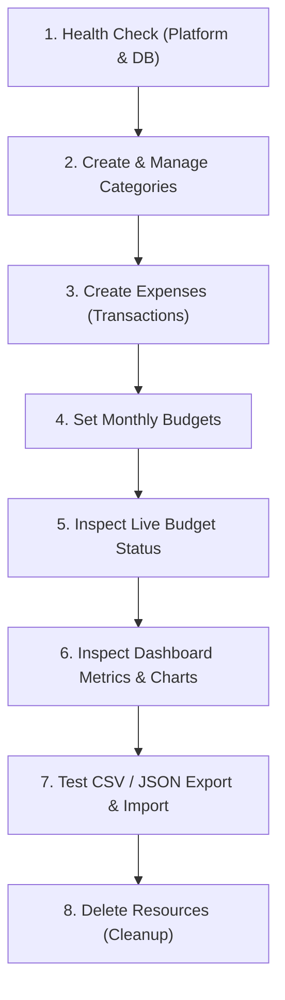

# FinTrack FastAPI Backend — Postman Testing Collection Guide

This guide provides a step-by-step, beginner-friendly manual testing walkthrough for the **FinTrack FastAPI Backend** using Postman.

All routes, request bodies, response schemas, and error codes in this guide reflect the **actual backend implementation** in `backend/app/`.

---

## Table of Contents
1. [Postman Setup Instructions](#1-postman-setup-instructions)
2. [Authentication Status & Token Setup](#2-authentication-status--token-setup)
3. [Recommended End-to-End Testing Order](#3-recommended-end-to-end-testing-order)
4. [Endpoint Reference & Manual Testing Guide](#4-endpoint-reference--manual-testing-guide)
   - [A. System Health Probes](#a-system-health-probes)
   - [B. Category Management](#b-category-management)
   - [C. Expenses & Transactions](#c-expenses--transactions)
   - [D. Budgets & Goals](#d-budgets--goals)
   - [E. Dashboard & Analytics](#e-dashboard--analytics)
   - [F. Data Export & Import](#f-data-export--import)
5. [Specific Verification Tests (Recent Fixes)](#5-specific-verification-tests-recent-fixes)
   - [Category Duplicate & Normalization Suite](#category-duplicate--normalization-suite)
   - [Budget Upsert & Validation Suite](#budget-upsert--validation-suite)
   - [Expense Validation Suite](#expense-validation-suite)
6. [Common Errors & Troubleshooting](#6-common-errors--troubleshooting)
7. [Independent Backend Verification](#7-independent-backend-verification)
8. [Final Testing Checklist](#8-final-testing-checklist)

---

## 1. Postman Setup Instructions

### Step 1: Download & Open Postman
- Download Postman from [postman.com/downloads](https://www.postman.com/downloads) (or use the web version at [web.postman.co](https://web.postman.co)).
- Open Postman and sign in (or click **"Skip and go to the app"**).

### Step 2: Create a New Collection
1. On the left sidebar, click **Collections**.
2. Click the **`+`** (Create new collection) button.
3. Rename the collection to: **`FinTrack API`**.

### Step 3: Create Postman Environments
Environments allow you to switch between your local machine and your deployed Render backend with a single click.

1. On the left sidebar, click **Environments**.
2. Click **`+`** to create an environment.
3. Name it: **`FinTrack Local`**.
4. Add the following variable:
   | Variable | Initial Value | Current Value |
   | :--- | :--- | :--- |
   | `base_url` | `http://localhost:8000` | `http://localhost:8000` |
5. Click **Save** (Ctrl+S / Cmd+S).

6. Create a second environment named: **`FinTrack Render (Production)`**.
7. Add the variable:
   | Variable | Initial Value | Current Value |
   | :--- | :--- | :--- |
   | `base_url` | `https://<your-backend-name>.onrender.com` | `https://<your-backend-name>.onrender.com` |
8. Click **Save**.

### Step 4: Select Your Active Environment
In the top-right corner of Postman, locate the environment dropdown (which default says *No Environment*) and select **`FinTrack Local`** (or **`FinTrack Render`** when testing your live cloud deployment).

> [!TIP]
> All URLs in this guide use `{{base_url}}`. When `FinTrack Local` is active, `{{base_url}}/health` automatically translates to `http://localhost:8000/health`.

---

## 2. Authentication Status & Token Setup

### Current MVP Implementation: Public Single-User REST API
In the current project release:
- **No authentication or login token is required.**
- All API routes are open REST endpoints.
- You do **NOT** need to send an `Authorization` header or Bearer token.

### Future Authentication Preparation (When User Auth is Added)
If authentication is enabled in future phases, configure your Postman collection as follows:
1. Call the `POST /api/v1/auth/login` endpoint with your credentials.
2. In the **Tests** tab of that request, add this auto-save script:
   ```javascript
   if (pm.response.code === 200) {
       var jsonData = pm.response.json();
       pm.environment.set("token", jsonData.data.token);
       console.log("Token saved to environment:", jsonData.data.token);
   }
   ```
3. On the **FinTrack API** collection root, click the **Authorization** tab:
   - **Type**: `Bearer Token`
   - **Token**: `{{token}}`
4. All child requests will then automatically inherit the authorization header:
   `Authorization: Bearer {{token}}`.

---

## 3. Recommended End-to-End Testing Order

To test dependencies logically (e.g. you cannot create an expense without first having a category), follow this sequence:



1. **Platform Health Probe** (`GET {{base_url}}/health`)
2. **Deep Database Health Check** (`GET {{base_url}}/api/v1/health`)
3. **Create Category** (`POST {{base_url}}/api/v1/categories`) $\rightarrow$ *Save returned `id` as `{{category_id}}`*
4. **Duplicate Category Validation Test** (`POST {{base_url}}/api/v1/categories`) $\rightarrow$ *Verify 409 Conflict*
5. **List Categories** (`GET {{base_url}}/api/v1/categories`)
6. **Rename Category** (`PUT {{base_url}}/api/v1/categories/{{category_id}}`)
7. **Create Expense** (`POST {{base_url}}/api/v1/expenses`) $\rightarrow$ *Save returned `id` as `{{expense_id}}`*
8. **List / Filter Expenses** (`GET {{base_url}}/api/v1/expenses`)
9. **Get Single Expense** (`GET {{base_url}}/api/v1/expenses/{{expense_id}}`)
10. **Update Expense** (`PUT {{base_url}}/api/v1/expenses/{{expense_id}}`)
11. **Create / Update Budget Goal** (`POST {{base_url}}/api/v1/budgets`)
12. **List Monthly Budgets** (`GET {{base_url}}/api/v1/budgets`)
13. **Get Live Budget Status** (`GET {{base_url}}/api/v1/budgets/status`)
14. **Get Dashboard Summary** (`GET {{base_url}}/api/v1/dashboard/summary`)
15. **Get Category Spend Breakdown** (`GET {{base_url}}/api/v1/dashboard/charts/by-category`)
16. **Get Spending Over Time** (`GET {{base_url}}/api/v1/dashboard/charts/over-time`)
17. **Get Month Comparison** (`GET {{base_url}}/api/v1/dashboard/compare`)
18. **Export Expenses (CSV & JSON)** (`GET {{base_url}}/api/v1/expenses/export/csv`, `json`)
19. **Import Expenses (CSV & JSON)** (`POST {{base_url}}/api/v1/expenses/import/csv`, `json`)
20. **Delete Expense** (`DELETE {{base_url}}/api/v1/expenses/{{expense_id}}`)
21. **Delete Budget** (`DELETE {{base_url}}/api/v1/budgets/{{budget_id}}`)
22. **Delete Category** (`DELETE {{base_url}}/api/v1/categories/{{category_id}}`)

---

## 4. Endpoint Reference & Manual Testing Guide

### Standard API Response Envelope Structure
All successful API v1 responses are wrapped in a standard envelope:
```json
{
  "success": true,
  "data": { ... },
  "meta": null
}
```
All errors return:
```json
{
  "success": false,
  "error": {
    "code": "ERROR_CODE",
    "message": "Human-readable message",
    "field": "field_name_if_validation_error"
  }
}
```

---

### A. System Health Probes

#### 1. Platform Root Health Check
- **Purpose**: Fast health check used by Render/Docker platform probes to verify the process is alive and database is reachable.
- **Method**: `GET`
- **URL**: `{{base_url}}/health`
- **Auth**: None
- **Headers**: None
- **Success Status**: `200 OK`
- **Success Response Example**:
  ```json
  {
    "status": "ok",
    "timestamp": "2026-08-27T14:30:00.000000+00:00",
    "database": "connected",
    "version": "1.0.0",
    "environment": "development"
  }
  ```
- **Error Status**: `503 Service Unavailable` if database is down (`"database": "disconnected"`).

##### How to test in Postman:
1. Click **`+`** to open a new tab.
2. Set Method to **GET**.
3. Enter URL: `{{base_url}}/health`
4. Click **Send**.
5. Confirm status code is `200 OK` and `"database": "connected"`.

---

#### 2. API v1 Deep Health Check
- **Purpose**: Deep health check validating FastAPI router mounting and an active database query (`SELECT 1`).
- **Method**: `GET`
- **URL**: `{{base_url}}/api/v1/health`
- **Auth**: None
- **Success Status**: `200 OK`
- **Success Response Example**:
  ```json
  {
    "status": "ok",
    "timestamp": "2026-08-27T14:30:00.000000+00:00",
    "database": "connected",
    "version": "1.0.0",
    "environment": "development"
  }
  ```

---

### B. Category Management

#### 3. List All Categories
- **Purpose**: Retrieve all categories along with real-time `expense_count` (how many expenses use each category).
- **Method**: `GET`
- **URL**: `{{base_url}}/api/v1/categories`
- **Auth**: None
- **Success Status**: `200 OK`
- **Success Response Example**:
  ```json
  {
    "success": true,
    "data": [
      {
        "id": "e4b2d56a-1234-5678-90ab-cdef12345678",
        "name": "Food & Dining",
        "created_at": "2026-08-27T10:00:00Z",
        "updated_at": "2026-08-27T10:00:00Z",
        "expense_count": 5
      }
    ],
    "meta": null
  }
  ```

---

#### 4. Create Category
- **Purpose**: Add a new custom category. Automatically trims whitespace, normalizes to Title Case, and rejects case-insensitive duplicates.
- **Method**: `POST`
- **URL**: `{{base_url}}/api/v1/categories`
- **Auth**: None
- **Required Headers**: `Content-Type: application/json`
- **Request Body Schema**:
  - `name` (string, 1 to 50 characters, required)
- **Example Request**:
  ```json
  {
    "name": "Groceries"
  }
  ```
- **Success Status**: `201 Created`
- **Success Response Example**:
  ```json
  {
    "success": true,
    "data": {
      "id": "d1a2b3c4-e5f6-7890-abcd-ef1234567890",
      "name": "Groceries",
      "created_at": "2026-08-27T14:35:00.123456Z",
      "updated_at": "2026-08-27T14:35:00.123456Z",
      "expense_count": 0
    },
    "meta": null
  }
  ```
- **Error Responses**:
  - `409 Conflict`: If category already exists:
    ```json
    {
      "success": false,
      "error": {
        "code": "CONFLICT",
        "message": "Category already exists.",
        "field": null
      }
    }
    ```
  - `422 Unprocessable Entity`: If name is empty or longer than 50 chars:
    ```json
    {
      "success": false,
      "error": {
        "code": "VALIDATION_ERROR",
        "message": "Category name cannot be empty or only whitespace",
        "field": "name"
      }
    }
    ```

##### How to test in Postman:
1. Open a new tab, select method **POST**.
2. Enter URL: `{{base_url}}/api/v1/categories`
3. Click **Headers** $\rightarrow$ ensure `Content-Type` is `application/json`.
4. Click **Body** $\rightarrow$ select **raw** $\rightarrow$ choose **JSON** from the format dropdown.
5. Paste:
   ```json
   {
     "name": "Entertainment"
   }
   ```
6. Click **Send**.
7. Confirm response status is `201 Created`.
8. Copy the generated `"id"` from the response so you can test expenses and updates!

---

#### 5. Rename an Existing Category
- **Purpose**: Update a category name.
- **Method**: `PUT`
- **URL**: `{{base_url}}/api/v1/categories/{{category_id}}`
- **Path Parameter**: `category_id` (UUID)
- **Request Body**:
  ```json
  {
    "name": "Fun & Entertainment"
  }
  ```
- **Success Status**: `200 OK`
- **Success Response Example**:
  ```json
  {
    "success": true,
    "data": {
      "id": "d1a2b3c4-e5f6-7890-abcd-ef1234567890",
      "name": "Fun & Entertainment",
      "created_at": "2026-08-27T14:35:00Z",
      "updated_at": "2026-08-27T14:40:00Z",
      "expense_count": 0
    },
    "meta": null
  }
  ```
- **Error Responses**:
  - `404 Not Found`: If `category_id` does not exist.
  - `409 Conflict`: If the new name already matches another category.

---

#### 6. Delete Category
- **Purpose**: Delete a category.
- **Method**: `DELETE`
- **URL**: `{{base_url}}/api/v1/categories/{{category_id}}`
- **Path Parameter**: `category_id` (UUID)
- **Query Parameters**:
  - `reassign_to` (UUID, optional): Category ID to reassign linked expenses to.
  - `cascade` (boolean, optional, default: `false`): If `true`, deletes all linked expenses along with the category.
- **Success Status**: `200 OK`
- **Success Response Example**:
  ```json
  {
    "success": true,
    "data": {
      "deleted": true,
      "id": "d1a2b3c4-e5f6-7890-abcd-ef1234567890"
    },
    "meta": null
  }
  ```
- **Error Responses**:
  - `409 Conflict`: If category is linked to expenses and neither `reassign_to` nor `cascade=true` is provided:
    ```json
    {
      "success": false,
      "error": {
        "code": "CONFLICT",
        "message": "Cannot delete category: 3 expenses are linked to it. Specify reassign_to or cascade=true.",
        "field": null
      }
    }
    ```

---

### C. Expenses & Transactions

#### 7. Create Expense
- **Purpose**: Log a new transaction.
- **Method**: `POST`
- **URL**: `{{base_url}}/api/v1/expenses`
- **Required Headers**: `Content-Type: application/json`
- **Request Body Schema**:
  - `title` (string, 1 to 50 chars, required)
  - `category_id` (UUID, required)
  - `amount` (number, strictly > 0, decimal places: 2, required)
  - `expense_date` (date string `YYYY-MM-DD`, cannot be in the future, default: today)
  - `notes` (string, optional)
  - `payment_mode` (string: `"cash"` | `"card"` | `"upi"` | `null`, optional)
- **Example Request**:
  ```json
  {
    "title": "Supermarket Weekly Shopping",
    "category_id": "{{category_id}}",
    "amount": 1450.50,
    "expense_date": "2026-08-27",
    "notes": "Vegetables and dairy items",
    "payment_mode": "upi"
  }
  ```
- **Success Status**: `201 Created`
- **Success Response Example**:
  ```json
  {
    "success": true,
    "data": {
      "id": "8f3e2b1a-9876-5432-10fe-dcba98765432",
      "title": "Supermarket Weekly Shopping",
      "category_id": "d1a2b3c4-e5f6-7890-abcd-ef1234567890",
      "category_name": "Groceries",
      "amount": "1450.50",
      "expense_date": "2026-08-27",
      "notes": "Vegetables and dairy items",
      "payment_mode": "upi",
      "created_at": "2026-08-27T14:45:00.000000Z",
      "updated_at": "2026-08-27T14:45:00.000000Z"
    },
    "meta": null
  }
  ```
- **Error Responses**:
  - `400 Bad Request`: If `category_id` does not exist in the database.
  - `422 Unprocessable Entity`: If `amount <= 0`, `expense_date` is in the future, or `payment_mode` is invalid.

##### How to test in Postman:
1. Select method **POST**.
2. URL: `{{base_url}}/api/v1/expenses`
3. In **Body** $\rightarrow$ **raw** $\rightarrow$ **JSON**, replace `{{category_id}}` with an actual category UUID obtained from `GET /api/v1/categories`.
4. Click **Send** $\rightarrow$ Verify status code `201 Created`.

---

#### 8. List Paginated Expenses (Search, Filter, Sort)
- **Purpose**: Fetch paginated expenses with dynamic query filters.
- **Method**: `GET`
- **URL**: `{{base_url}}/api/v1/expenses`
- **Query Parameters**:
  | Parameter | Type | Default | Description |
  | :--- | :--- | :--- | :--- |
  | `page` | integer | `1` | Page number (ge=1) |
  | `page_size` | integer | `20` | Items per page (1–100) |
  | `search` | string | `null` | Substring search on `title` or `notes` |
  | `category_id` | UUID | `null` | Filter by category |
  | `date_from` | string | `null` | Start date (`YYYY-MM-DD`) |
  | `date_to` | string | `null` | End date (`YYYY-MM-DD`) |
  | `amount_min` | number | `null` | Minimum amount |
  | `amount_max` | number | `null` | Maximum amount |
  | `payment_mode`| string | `null` | `"cash"` \| `"card"` \| `"upi"` |
  | `sort_by` | string | `"expense_date"`| Column: `expense_date`, `amount`, `title` |
  | `sort_dir` | string | `"desc"` | Direction: `asc` or `desc` |
- **Example URL with Filters**:
  `{{base_url}}/api/v1/expenses?search=shopping&payment_mode=upi&page=1&page_size=10`
- **Success Status**: `200 OK`
- **Success Response Example**:
  ```json
  {
    "success": true,
    "data": [
      {
        "id": "8f3e2b1a-9876-5432-10fe-dcba98765432",
        "title": "Supermarket Weekly Shopping",
        "category_id": "d1a2b3c4-e5f6-7890-abcd-ef1234567890",
        "category_name": "Groceries",
        "amount": "1450.50",
        "expense_date": "2026-08-27",
        "notes": "Vegetables and dairy items",
        "payment_mode": "upi",
        "created_at": "2026-08-27T14:45:00Z",
        "updated_at": "2026-08-27T14:45:00Z"
      }
    ],
    "meta": {
      "page": 1,
      "page_size": 10,
      "total": 1,
      "total_pages": 1
    }
  }
  ```

---

#### 9. Retrieve Single Expense
- **Purpose**: Get full details of a specific expense by ID.
- **Method**: `GET`
- **URL**: `{{base_url}}/api/v1/expenses/{{expense_id}}`
- **Path Parameter**: `expense_id` (UUID)
- **Success Status**: `200 OK`
- **Error Response**: `404 Not Found` if expense ID does not exist.

---

#### 10. Update Expense
- **Purpose**: Modify an existing expense partially or fully.
- **Method**: `PUT`
- **URL**: `{{base_url}}/api/v1/expenses/{{expense_id}}`
- **Path Parameter**: `expense_id` (UUID)
- **Request Body (All fields optional)**:
  ```json
  {
    "title": "Updated Supermarket Bill",
    "amount": 1520.00,
    "payment_mode": "card"
  }
  ```
- **Success Status**: `200 OK`
- **Error Response**: `404 Not Found` if expense does not exist.

---

#### 11. Delete Expense
- **Purpose**: Permanently delete an expense record.
- **Method**: `DELETE`
- **URL**: `{{base_url}}/api/v1/expenses/{{expense_id}}`
- **Path Parameter**: `expense_id` (UUID)
- **Success Status**: `200 OK`
- **Success Response Example**:
  ```json
  {
    "success": true,
    "data": {
      "deleted": true,
      "id": "8f3e2b1a-9876-5432-10fe-dcba98765432"
    },
    "meta": null
  }
  ```
- **Error Response**: `404 Not Found` if expense does not exist.

---

### D. Budgets & Goals

#### 12. Create or Update Monthly Budget (Upsert)
- **Purpose**: Set a budget limit for a category or overall monthly spending. If a budget already exists for that category and month, it automatically updates the limit.
- **Method**: `POST`
- **URL**: `{{base_url}}/api/v1/budgets`
- **Request Body Schema**:
  - `category_id` (UUID or `null`, default: `null` for overall monthly budget)
  - `period_month` (date `YYYY-MM-DD`, automatically normalized to 1st of month)
  - `limit_amount` (number, strictly > 0, required)
- **Example Request (Category Budget)**:
  ```json
  {
    "category_id": "{{category_id}}",
    "period_month": "2026-08-01",
    "limit_amount": 5000.00
  }
  ```
- **Example Request (Overall Monthly Budget)**:
  ```json
  {
    "category_id": null,
    "period_month": "2026-08-01",
    "limit_amount": 25000.00
  }
  ```
- **Success Status**: `201 Created`
- **Success Response Example**:
  ```json
  {
    "success": true,
    "data": {
      "id": "7a8b9c0d-1122-3344-5566-778899aabbcc",
      "category_id": "d1a2b3c4-e5f6-7890-abcd-ef1234567890",
      "category_name": "Groceries",
      "period_month": "2026-08-01",
      "limit_amount": "5000.00",
      "created_at": "2026-08-27T15:00:00Z",
      "updated_at": "2026-08-27T15:00:00Z"
    },
    "meta": null
  }
  ```

---

#### 13. List Monthly Budgets
- **Purpose**: Get all active budget goals for a specific month.
- **Method**: `GET`
- **URL**: `{{base_url}}/api/v1/budgets?period_month=2026-08-01`
- **Query Parameter**: `period_month` (date `YYYY-MM-DD`, defaults to current month)
- **Success Status**: `200 OK`

---

#### 14. Get Live Budget Status & Progress
- **Purpose**: Retrieve real-time progress calculations: spent amount, remaining balance, percentage used, and budget health status (`on_track`, `near_limit`, or `over_budget`).
- **Method**: `GET`
- **URL**: `{{base_url}}/api/v1/budgets/status?period_month=2026-08-01`
- **Query Parameter**: `period_month` (date `YYYY-MM-DD`, defaults to current month)
- **Success Status**: `200 OK`
- **Success Response Example**:
  ```json
  {
    "success": true,
    "data": {
      "overall": {
        "budget_id": "7a8b9c0d-1122-3344-5566-778899aabbcc",
        "category_id": null,
        "category_name": "Overall",
        "period_month": "2026-08-01",
        "limit_amount": "25000.00",
        "spent_amount": "1450.50",
        "remaining_amount": "23549.50",
        "percentage_used": 5.8,
        "status": "on_track"
      }
    },
    "meta": null
  }
  ```

---

#### 15. Delete Budget Goal
- **Purpose**: Delete a budget goal.
- **Method**: `DELETE`
- **URL**: `{{base_url}}/api/v1/budgets/{{budget_id}}`
- **Path Parameter**: `budget_id` (UUID)
- **Success Status**: `200 OK`
- **Success Response**: `{"success": true, "data": {"deleted": true}, "meta": null}`

---

### E. Dashboard & Analytics

#### 16. Overall Dashboard Summary
- **Purpose**: Provides high-level metrics: total spent lifetime, total spent this month, 5 most recent expenses, top spending categories ranked by spend, and daily/weekly average spend.
- **Method**: `GET`
- **URL**: `{{base_url}}/api/v1/dashboard/summary`
- **Success Status**: `200 OK`
- **Success Response Example**:
  ```json
  {
    "success": true,
    "data": {
      "total_spent_overall": "1450.50",
      "total_spent_current_month": "1450.50",
      "recent_expenses": [ ... ],
      "top_categories": [
        {
          "category_id": "d1a2b3c4-e5f6-7890-abcd-ef1234567890",
          "category_name": "Groceries",
          "total_amount": "1450.50",
          "percentage": 100.0
        }
      ],
      "overall_budget_status": null,
      "average_daily_spend": "53.72",
      "average_weekly_spend": "362.62"
    },
    "meta": null
  }
  ```

---

#### 17. Spending by Category (Pie Chart Data)
- **Purpose**: Category-wise distribution for charts.
- **Method**: `GET`
- **URL**: `{{base_url}}/api/v1/dashboard/charts/by-category?date_from=2026-08-01&date_to=2026-08-31`
- **Query Parameters**: `date_from`, `date_to` (both optional)
- **Success Status**: `200 OK`

---

#### 18. Spending Over Time (Time-Series Trend)
- **Purpose**: Aggregated spending by interval for bar and line charts.
- **Method**: `GET`
- **URL**: `{{base_url}}/api/v1/dashboard/charts/over-time?granularity=daily`
- **Query Parameters**:
  - `granularity`: `"daily"` | `"weekly"` | `"monthly"` (default: `"daily"`)
  - `date_from`, `date_to` (optional)
- **Success Status**: `200 OK`

---

#### 19. Month-over-Month Comparison
- **Purpose**: Compares current month spending against previous month spending with percentage change and an `is_increase` indicator.
- **Method**: `GET`
- **URL**: `{{base_url}}/api/v1/dashboard/compare`
- **Success Status**: `200 OK`
- **Success Response Example**:
  ```json
  {
    "success": true,
    "data": {
      "current_month": "2026-08-01",
      "current_month_total": "1450.50",
      "previous_month": "2026-07-01",
      "previous_month_total": "0.00",
      "percentage_change": 100.0,
      "is_increase": true
    },
    "meta": null
  }
  ```

---

### F. Data Export & Import

#### 20. Export Expenses as CSV
- **Purpose**: Download expenses matching active filters as a formatted CSV file.
- **Method**: `GET`
- **URL**: `{{base_url}}/api/v1/expenses/export/csv`
- **Response Headers**: `Content-Type: text/csv`, `Content-Disposition: attachment; filename="fintrack_expenses_....csv"`
- **How to test in Postman**: Click **Send and Download** next to the blue **Send** button in Postman to save the CSV file directly to your disk!

---

#### 21. Export Expenses as JSON
- **Purpose**: Export all filtered expenses as structured JSON.
- **Method**: `GET`
- **URL**: `{{base_url}}/api/v1/expenses/export/json`
- **Success Status**: `200 OK`

---

#### 22. Import Expenses from CSV
- **Purpose**: Bulk import expenses with line-by-line validation and duplicate skip detection.
- **Method**: `POST`
- **URL**: `{{base_url}}/api/v1/expenses/import/csv`
- **Request Body**:
  ```json
  {
    "csv_content": "Date,Title,Category,Amount,Payment Mode,Notes\n2026-08-20,Coffee,Food & Dining,120.00,upi,Starbucks\n2026-08-21,Metro Pass,Transport,450.00,card,Monthly recharge"
  }
  ```
- **Success Status**: `200 OK`
- **Success Response Example**:
  ```json
  {
    "success": true,
    "data": {
      "total_rows": 2,
      "imported_count": 2,
      "failed_count": 0,
      "errors": []
    },
    "meta": null
  }
  ```

---

#### 23. Import Expenses from JSON
- **Purpose**: Bulk import structured expense items.
- **Method**: `POST`
- **URL**: `{{base_url}}/api/v1/expenses/import/json`
- **Request Body**:
  ```json
  {
    "items": [
      {
        "title": "Gym Membership",
        "category_name": "Health & Fitness",
        "amount": 2500.00,
        "expense_date": "2026-08-01",
        "payment_mode": "card",
        "notes": "Quarterly plan"
      }
    ]
  }
  ```
- **Success Status**: `200 OK`

---

## 5. Specific Verification Tests (Recent Fixes)

Use this section to manually verify the bugs and features resolved in recent milestones.

### Category Duplicate & Normalization Suite

#### Test 1: Normal Category Creation
1. Send `POST {{base_url}}/api/v1/categories` with body:
   ```json
   { "name": "Travel Expenses" }
   ```
2. **Expected**: `201 Created`, category name is `"Travel Expenses"`.

#### Test 2: Exact Duplicate Rejection
1. Send the exact same request again:
   ```json
   { "name": "Travel Expenses" }
   ```
2. **Expected**:
   - Status: `409 Conflict`
   - Response:
     ```json
     {
       "success": false,
       "error": {
         "code": "CONFLICT",
         "message": "Category already exists.",
         "field": null
       }
     }
     ```
   - **Crucial Check**: Verify that **NO raw SQLAlchemy, psycopg2, or UniqueViolation traceback** is returned in the response.

#### Test 3: Case-Insensitive Duplicate Rejection
1. Send `POST {{base_url}}/api/v1/categories` with lowercase:
   ```json
   { "name": "travel expenses" }
   ```
2. **Expected**: `409 Conflict` with message `"Category already exists."`.
3. Send with uppercase:
   ```json
   { "name": "TRAVEL EXPENSES" }
   ```
4. **Expected**: `409 Conflict` with message `"Category already exists."`.

#### Test 4: Whitespace Trimming and Normalization
1. Send `POST {{base_url}}/api/v1/categories` with leading/trailing spaces:
   ```json
   { "name": "   Travel Expenses   " }
   ```
2. **Expected**: `409 Conflict` (recognized as `"Travel Expenses"`).
3. Send a new category with irregular casing and multiple internal spaces:
   ```json
   { "name": "  home   repairs  " }
   ```
4. **Expected**: `201 Created`, normalized neatly to `"Home Repairs"`.

---

### Budget Upsert & Validation Suite

#### Test 5: Create a New Budget
1. Send `POST {{base_url}}/api/v1/budgets` with:
   ```json
   {
     "period_month": "2026-08-01",
     "limit_amount": 10000.00
   }
   ```
2. **Expected**: `201 Created`.

#### Test 6: Upsert (Update) the Existing Budget
1. Send `POST {{base_url}}/api/v1/budgets` with the **same month** and updated limit:
   ```json
   {
     "period_month": "2026-08-01",
     "limit_amount": 12500.00
   }
   ```
2. **Expected**: `201 Created`, with `"limit_amount": "12500.00"` (it updates the existing row rather than throwing a duplicate error).

#### Test 7: Budget Validation (Invalid Negative Amount)
1. Send `POST {{base_url}}/api/v1/budgets` with negative amount:
   ```json
   {
     "period_month": "2026-08-01",
     "limit_amount": -500.00
   }
   ```
2. **Expected**:
   - Status: `422 Unprocessable Entity`
   - Response:
     ```json
     {
       "success": false,
       "error": {
         "code": "VALIDATION_ERROR",
         "message": "Input should be greater than 0",
         "field": "limit_amount"
       }
     }
     ```

---

### Expense Validation Suite

#### Test 8: Future Date Rejection
1. Send `POST {{base_url}}/api/v1/expenses` with a future date (e.g. year 2099):
   ```json
   {
     "title": "Future Item",
     "category_id": "{{category_id}}",
     "amount": 250.00,
     "expense_date": "2099-12-31"
   }
   ```
2. **Expected**:
   - Status: `422 Unprocessable Entity`
   - Response: `"message": "Value error, Expense date cannot be in the future"`

#### Test 9: Invalid Payment Mode
1. Send `POST {{base_url}}/api/v1/expenses` with an unknown payment mode:
   ```json
   {
     "title": "Snacks",
     "category_id": "{{category_id}}",
     "amount": 150.00,
     "payment_mode": "crypto"
   }
   ```
2. **Expected**:
   - Status: `422 Unprocessable Entity`
   - Response: `"message": "Value error, Payment mode must be 'cash', 'card', 'upi', or null"`

---

## 6. Common Errors & Troubleshooting

| Error | Meaning | How to Fix |
| :--- | :--- | :--- |
| **Could not send request / Network Error** | Postman cannot connect to the server at `{{base_url}}`. | 1. If local: Check if your FastAPI server is running (`uvicorn app.main:app --reload`).<br>2. If Render: Check if your backend URL is typed correctly (`https://<app>.onrender.com`).<br>3. Render free tier takes 15–30 seconds to wake up; wait a moment and resend. |
| **404 Not Found** | The URL path does not exist. | Check for missing `/api/v1` prefix! For example, `{{base_url}}/categories` is wrong; the correct route is `{{base_url}}/api/v1/categories`. |
| **409 Conflict** | Resource conflict. | You tried to create a duplicate category, or tried to delete a category that currently has linked expenses. |
| **422 Unprocessable Entity** | Pydantic request validation failed. | Check the `"field"` and `"message"` in the error envelope. Usually means: negative amount, future date, missing required field, or invalid JSON syntax. |
| **500 Internal Server Error** | Unexpected backend crash. | Check your backend terminal or Render logs. Internal errors are safely caught and do not leak database credentials. |
| **503 Service Unavailable** | Platform is up, but database connection failed. | In `/health`, check if `"database": "disconnected"`. Verify your PostgreSQL server / Supabase instance is online and `DATABASE_URL` is set correctly. |

> [!NOTE]
> **CORS in Postman**:
> When testing via Postman, you will **never** receive a browser CORS error! CORS (`Cross-Origin Resource Sharing`) is a security mechanism enforced exclusively inside web browsers (like Chrome or Safari). Postman is a direct desktop HTTP client and does not block cross-origin requests.

---

## 7. Independent Backend Verification

To verify that your FastAPI backend is 100% operational independently of the React frontend:

### Method 1: Browser or cURL Probe
Open your web browser and visit:
```
http://localhost:8000/health
```
or (for deployed Render):
```
https://<your-backend-name>.onrender.com/health
```
If you see:
```json
{"status": "ok", "database": "connected"}
```
Your backend process, Python runtime, and PostgreSQL database connection are fully healthy!

### Method 2: FastAPI Interactive Swagger Documentation
FastAPI provides an automatic, interactive UI at:
```
http://localhost:8000/docs
```
or
```
https://<your-backend-name>.onrender.com/docs
```
You can inspect every single schema, click **"Try it out"**, and execute queries directly in your browser.

---

## 8. Final Testing Checklist

Follow this checklist and mark each box as you test in Postman:

- [ ] **Setup**: Postman environment configured with `base_url`.
- [ ] **Health 1**: `GET {{base_url}}/health` returns `200 OK` and `"database": "connected"`.
- [ ] **Health 2**: `GET {{base_url}}/api/v1/health` returns `200 OK`.
- [ ] **Category 1**: `POST {{base_url}}/api/v1/categories` successfully creates `"Groceries"`.
- [ ] **Category 2 (Duplicate)**: Creating `"Groceries"` again returns clean `409 Conflict`.
- [ ] **Category 3 (Case Insensitive)**: Creating `"groceries"` and `"GROCERIES"` returns `409 Conflict`.
- [ ] **Category 4 (Spaces)**: Creating `"  Groceries  "` returns `409 Conflict`.
- [ ] **Category 5**: `GET {{base_url}}/api/v1/categories` lists all categories with `expense_count`.
- [ ] **Category 6**: `PUT {{base_url}}/api/v1/categories/{id}` renames category.
- [ ] **Expense 1**: `POST {{base_url}}/api/v1/expenses` logs an expense with valid `category_id`.
- [ ] **Expense 2 (Validation)**: Expense with future date returns `422 Unprocessable Entity`.
- [ ] **Expense 3 (Validation)**: Expense with amount `<= 0` returns `422 Unprocessable Entity`.
- [ ] **Expense 4**: `GET {{base_url}}/api/v1/expenses` returns paginated transactions with `meta`.
- [ ] **Expense 5**: `GET {{base_url}}/api/v1/expenses?search=...` filters correctly.
- [ ] **Expense 6**: `PUT {{base_url}}/api/v1/expenses/{id}` updates amount/title.
- [ ] **Budget 1**: `POST {{base_url}}/api/v1/budgets` creates a monthly goal.
- [ ] **Budget 2 (Upsert)**: `POST {{base_url}}/api/v1/budgets` with same month updates the goal.
- [ ] **Budget 3**: `GET {{base_url}}/api/v1/budgets/status` returns remaining balance and status.
- [ ] **Dashboard 1**: `GET {{base_url}}/api/v1/dashboard/summary` returns summary metrics.
- [ ] **Dashboard 2**: `GET {{base_url}}/api/v1/dashboard/charts/by-category` returns pie chart data.
- [ ] **Dashboard 3**: `GET {{base_url}}/api/v1/dashboard/charts/over-time` returns trend data.
- [ ] **Dashboard 4**: `GET {{base_url}}/api/v1/dashboard/compare` returns month-over-month change.
- [ ] **Export/Import 1**: `GET {{base_url}}/api/v1/expenses/export/csv` downloads CSV.
- [ ] **Export/Import 2**: `POST {{base_url}}/api/v1/expenses/import/csv` imports rows.
- [ ] **Cleanup 1**: `DELETE {{base_url}}/api/v1/expenses/{id}` deletes expense.
- [ ] **Cleanup 2**: `DELETE {{base_url}}/api/v1/budgets/{id}` deletes budget.
- [ ] **Cleanup 3**: `DELETE {{base_url}}/api/v1/categories/{id}` deletes category.
